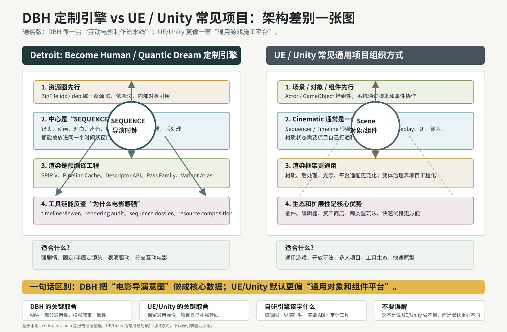
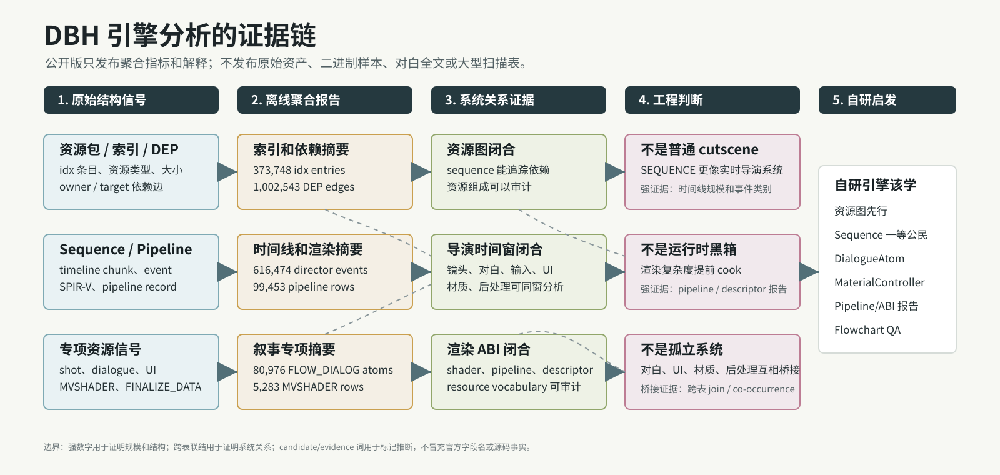

# 总览：DBH 到底强在哪里

先说结论：DBH 的强项不是“播片播得好”，也不是“画面效果堆得多”。它真正厉害的地方，是把互动电影需要的东西做成了一整套生产系统。

一个普通项目里，剧情可能在脚本里，相机在相机系统里，字幕在 UI 里，对白在音频系统里，材质状态在角色材质脚本里，后处理在相机 volume 里。每个系统单独看都能工作，但一旦你要做复杂分支，就会出现一堆同步问题：玩家输入窗口和镜头不贴，字幕和表演不同步，角色受伤状态跨镜头丢失，后处理忘记恢复，某个分支少打包一个音频或动画。

DBH 的证据更像另一种做法：先把这些内容 cook 成数据，再用资源图和导演时间线把它们连起来。运行时当然仍然要执行逻辑，但大量“这段戏需要什么、什么时候发生、依赖哪些资源、会影响哪些系统”的信息，在构建阶段就已经可以检查。

## cooked asset-graph cinematic engine 是什么意思

这个词可以拆开看。

`cooked` 指的是内容不是临时从编辑器格式直接跑起来，而是经过构建流程，变成运行时更容易加载、更容易校验的数据。

`asset-graph` 指的是资源之间不是散的。每个资源有 ID、类型、大小、包位置和依赖关系。比如一个 sequence 可以依赖动画、声音、对白 atom、本地化容器、UI 资源、后处理 preset 等。

`cinematic engine` 指的是它的中心问题不是“怎么摆几个 GameObject”，而是“怎么稳定生产可交互的电影段落”。这会影响引擎从资源系统、渲染、相机、对白、UI 到 QA 工具的全部设计。

所以这句话的通俗版本是：

> DBH 像一条互动电影生产流水线。资源、镜头、动画、对白、输入、分支、材质和渲染都被做成可检查的数据，而不是靠运行时脚本临时凑在一起。

## 和常见 UE/Unity 项目有什么不同

很多通用引擎项目的组织方式是“场景/对象/组件先行”。你先有 Actor 或 GameObject，再挂动画、相机、UI、音频、脚本、后处理。它很灵活，适合各种类型。

DBH 这类项目更像“段落/资源/时间线先行”。你先关心一个剧情段落需要哪些资源，哪些事件在什么时候发生，哪些系统要在同一时间窗里协作。对象和组件仍然存在，但它们不是唯一中心。

可以粗略对比成这样：

| 维度 | 常见通用项目 | DBH 证据指向的方式 |
|---|---|---|
| 内容组织 | 场景、对象、组件、脚本 | 资源图、sequence、导演事件 |
| 剧情段落 | cutscene、脚本、触发器混合 | `SEQUENCE` 统一调度大量事件 |
| 对白 | 音频、字幕、本地化分开接 | `FLOW_DIALOG` 与声音、事件、动画、本地化联动 |
| 相机 | gameplay camera + cutscene camera | shot/lens/light + camera bank + modifier |
| 渲染 | shader 和材质逐步堆功能 | SPIR-V、pipeline state、descriptor ABI、pass family 可审计 |
| QA | 看录屏、查日志、人工排查 | 可以按资源、时间窗、事件类别、pass family 做审计 |

这不是说通用引擎不好，而是说明 DBH 的目标很明确：它为“强剧情互动电影”做了大量专门工程。

## 三个最硬的底座

### 1. 资源图

资源索引里有 373,748 个条目、41 类资源，完整 DEP 导出有 1,002,543 条边。这个规模说明它不是只把文件塞进包里，而是保留了大量资源依赖信息。

对开发者来说，资源图解决的是“我能不能追责”的问题。某个 sequence 少了一句对白、某个分支缺一个动画、某个后处理 preset 没打包，如果没有资源图，就只能靠运行时失败和人工排查。有资源图，就可以在构建阶段发现问题。

### 2. 导演时间线

全量扫描恢复出 5,479 个 `SEQUENCE`、1,117,054 个 timeline chunk、616,474 个 director event。更重要的是，这些事件不只包含动画和镜头，还包含声音、对白、输入、分支、变量、UI、材质 controller、后处理等类别。

这说明它的电影感不是简单靠美术资产，而是靠“事件被放进同一条可审计时间轴”。

### 3. 渲染预编译和审计

渲染侧有 81,649 个 SPIR-V module、99,453 条 pipeline-state record、42,343 个 shader pair、729,418 条 QDIF/SPIR-V matched descriptor binding。它的渲染复杂度不是靠运行时临时猜，而是提前 cook 出大量状态和绑定信息。

对自研引擎来说，这个点非常实际：一旦项目进入大量角色、大量镜头、大量后处理和材质状态切换，渲染系统如果没有 pipeline/descriptor/variant 的离线报告，很快就会变成黑箱。

## 一张图

这张图不是说 UE/Unity 做不到类似系统，而是说明 DBH 的组织重心不同。它更早地把“叙事段落”和“资源依赖”放到中心，而不是最后再用脚本把各系统粘起来。

## 证据链

公开版只保留聚合证据，不发布原始样本。你可以把这份仓库理解成一份“证据摘要 + 工程解释”。如果某个结论是强证据支持的，我会尽量给出数量和来源；如果只是候选解释，我会用 candidate/evidence 这样的词，不把它写成官方字段名。

## 开发者应该带走什么

如果你正在做自己的引擎，最值得学的是这些原则：

1. 内容先进入资源图，再进入运行时。
2. 剧情段落要有统一时间线，而不是散在一堆回调里。
3. 对白、动画、镜头、UI、输入、分支必须能在同一个时间窗里检查。
4. 渲染要有 pipeline cache、descriptor/resource ABI、shader variant 报告。
5. 角色状态 controller 要跨脚本、sequence、材质和 GPU layout。
6. QA 工具要能从资源、时间、渲染、对白、分支多个角度反查问题。

这些东西不一定一开始就全部做完，但从第一天就应该留出数据模型和构建管线的位置。否则项目规模一上来，所有“电影感”都会变成手工维护成本。
